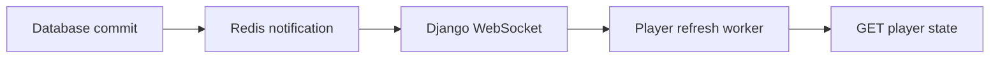

# Live player updates

The server uses Django Channels and Redis to notify the Python player after its
state changes. The player keeps one authenticated WebSocket open and uses its
existing REST refresh worker to fetch the latest state and update playback.

Updated players also use this connection to estimate server time and follow a
persisted playback timeline. Multiple computers using the same Player token
share loop positions, transitions, and vote-chime deadlines. See
[synchronized players](player-synchronization.md) for the BeatSync research,
server migration, timing protocol, and physical synchronization test procedure.



PostgreSQL remains authoritative. Redis contains transient notifications and
connection groups; it needs no backups or durable volume. Missed messages are
recovered by a refresh after connection establishment and each player's
admin-managed fallback reconciliation interval (30 seconds by default). A Redis
outage can delay updates until the next REST refresh, but notification failures
do not roll back saved state.

## Local development

Keep the existing `env/.env` configured for the development database, storage,
and `DEBUG=True`. Add this value if Redis runs locally:

```dotenv
REDIS_URL=redis://127.0.0.1:6379/0
```

With Docker and Docker Compose installed, run from the repository root:

```sh
make redis
make server
```

`make redis` starts only Redis in a separate development Compose project, waits
for it to be healthy, and binds port 6379 to `127.0.0.1`. `make server` installs
dependencies with `uv sync`, prepares the database and frontend, and launches
Vite, the ASGI server, the background worker, and the prediction scheduler.
Redis stays running when the development server stops. Use `make redis-down`
to stop it, or `make redis-logs` to inspect its output. A native or managed Redis
instance can be used instead by setting `REDIS_URL` in every server process.

The development Procfile runs Uvicorn with reload and
`config.asgi_dev:application`. This wrapper serves Django static files in debug
mode, including the admin's styles. The ordinary Django `runserver` command
does not serve this WebSocket endpoint. To start just the ASGI process from
`src/server`:

```sh
uv sync
uv run uvicorn config.asgi_dev:application --app-dir src --host 127.0.0.1 --port 8000 --reload --reload-dir src
```

Start the player in another terminal from the repository root:

```sh
make player token=YOUR_PLAYER_TOKEN
```

`make player` also runs `uv sync` so the WebSocket client dependency is installed.
Use the player's existing `COSOUND_API_URL` setting to choose another backend.
For example, `https://api.cosound.ca` connects the socket to
`wss://api.cosound.ca/ws/player/`; `http://localhost:8000/api` connects to
`ws://localhost:8000/ws/player/`. `COSOUND_WS_URL` can explicitly set the socket
URL when a proxy exposes a different path.

## Docker deployment

The production Compose file includes a `redis:8-alpine` service with a health
check. It publishes no host port. The web, worker, scheduler, and release
services all receive `REDIS_URL=redis://redis:6379/0` by default and wait for
Redis to be healthy. Existing production environment files without `REDIS_URL`
continue to work. All Django processes must use the same Redis endpoint and
database number.

Redis has a 32 MB data limit and a 64 MB container memory limit for the existing
1 GB server. Persistence is disabled and `/data` is temporary memory. At the
data limit, Redis rejects new writes rather than evicting active connection
groups; notification errors are logged, and REST reconciliation continues.
Increase the limits if the number of concurrent players grows substantially.

An explicit `REDIS_URL` in `env/.env` or the shell overrides the Compose default;
use `rediss://` for a managed service that requires TLS. This redirects the
application but does not disable the bundled Redis service or its health
dependencies. Do not expose the bundled Redis port publicly.

After reviewing and deploying the code through the normal release process:

```sh
make docker-build
make docker-up
make docker-ps
```

Caddy's existing `reverse_proxy web:8000` configuration forwards WebSocket
upgrades. Production continues using the existing Gunicorn/Uvicorn ASGI worker
and WhiteNoise static files.

## Connection protocol

Connect to `/ws/player/` with the existing player token in the `X-API-Key`
request header. Do not put the token in a URL. The server selects the player
group from the authenticated token; clients cannot subscribe to another
player's ID. Authentication is checked at connection time, before delivering a
change notification, and during 60-second connection maintenance so revoked
tokens and deleted players lose access even while idle.

After subscription, the server sends:

```json
{"type": "player.ready", "schema_version": 1, "sync_version": 1}
```

After a relevant transaction commits, it sends:

```json
{"type": "player.changed", "schema_version": 1}
```

Both messages trigger the existing player refresh path. Events contain no
state snapshot or credentials. Multiple events may be coalesced into a refresh
of the latest state. They are notifications, not a durable event log, and do
not guarantee one delivery per database write. The client reconnects with
backoff and refreshes when the subscription is ready again. Playback work
remains serialized by the existing refresh worker.

The REST response includes the player metadata, `sleeping` state, a `runtime`
object with the fallback state-poll interval, and a `chime` descriptor with
a download URL, stable version, and volume. Metadata
changes refresh the interface without reloading unchanged audio. Changes to
the desired audio still require downloading, preparing, and crossfading sounds.
`PLAYER_API_RATE` defaults to `120/m` across the player API endpoints to allow
event-triggered refreshes; rate limits are keyed by the stable player ID.
The prediction scheduler uses the algorithm refresh interval on each player's
assigned Local Post. A vote does not create a new prediction immediately just
because notifications are enabled; it is considered on that Local Post's next
scheduled algorithm run.

## Model changes and explicit notifications

### Vote confirmation sound

New votes send a separate event after the database transaction commits:

```json
{"type": "player.vote_received", "schema_version": 1, "vote_id": 123}
```

Each Local Post can provide its own uploaded vote-confirmation chime. The
player downloads that one-shot into a dedicated, versioned cache, decodes and
resamples it to the output device, and swaps it in without changing the current
mix. A changed Local Post chime sends `player.changed`, so the normal refresh
path picks it up even when the soundscape layers are unchanged. If no custom
file is configured, the player uses its original locally synthesized 450 ms
bell. A failed download or invalid file preserves the last working sound and is
retried on a later refresh.

Consecutive chimes never sound the same pitch. The player steps through a major
pentatonic scale — `VOTE_CHIME_SCALE` in `app/chime.py`, one octave as
semitones above A5 — advancing one degree per vote and wrapping at the octave,
so a busy room hears a phrase rather than a repeated note. The scale is baked
into the player, not configured per post: the built-in bell is synthesized
directly at each degree, and an uploaded one-shot is repitched onto the same
degrees by resampling, which shortens it as it rises. Pentatonic is what makes
this safe under overlap — it has no minor second and no tritone, so any
combination of voices sounding at once stays consonant. Every degree is
rendered up front, when the chime is installed, because the audio callback
cannot resample; each is held to the same peak ceiling as the root.

How loud the chime is comes from the Player Program's `chime_volume`, from 0 to
1, and rides in the same descriptor. It is a level relative to the mix rather
than an absolute one, and loudness is compared with loudness: the player
matches the one-shot's short-term RMS — its loudest
`VOTE_CHIME_RMS_WINDOW_SECONDS`, which ignores a decay tail or the silence at
the end of an upload — to `chime_volume × VOTE_CHIME_MAX_RATIO` times the mix's
own running RMS, averaged over `VOTE_CHIME_RMS_SECONDS` so a transient does not
swing the next acknowledgement. One setting therefore sounds the same over a
sparse mix and a dense one. With `VOTE_CHIME_MAX_RATIO` at 4, **0.25 is level
with the soundscape and 1.0 is four times its level**; the range above parity is
the point, since a chime that merely matches the mix is easy to miss.

Comparing the chime's *peak* against the mix's RMS is the trap here, and was a
bug once: the tone's crest factor is about 2.5, so aiming its peak at the mix's
level leaves it audibly under the soundscape. Two bounds hold either end.
`VOTE_CHIME_RMS_FLOOR` keeps a vote audible in a silent or sleeping room, and
`VOTE_CHIME_OUTPUT_CEILING` keeps one acknowledgement off the clipper whatever
the mix is doing — on a dense mix that ceiling, not the setting, is what limits
the top of the range. A burst may still reach the clipper, since eight voices
can overlap. `VOTE_CHIME_PEAK` is now only the level the buffers are stored at,
not a limit on how loud a chime may sound; the player re-levels whatever it is
given by measuring it.

The setting applies to the built-in bell as well as an upload, and changing it
alone does not change the chime version, so the player re-levels without
re-downloading anything.

The chime uses the existing audio output and follows master volume and mute. It
does not wait for the prediction cycle. Listener details are never sent.
Rejected votes, rolled-back transactions, edits to existing votes, and wake-up
requests that do not create a vote do not play it. The player remembers the
last 512 vote IDs across reconnects within its current run to suppress duplicate
events. At most eight chime voices overlap during a burst; the newest tap
replaces the oldest voice at that limit.

These are live, best-effort confirmations, not a persistent notification queue.
Votes saved while the player is offline or Redis is unavailable remain saved,
but their sounds are not replayed on reconnection.

### State changes

Signal hooks cover saved/deleted players, Local Post vote-chime changes, sound
collection membership, relevant sound metadata and deletions, manager names,
and artist credits. Notifications run after the surrounding database
transaction commits, so a rolled-back update does not notify a player.

`QuerySet.update()`, `bulk_update()`, `bulk_create()`, raw SQL, and direct writes
to many-to-many through tables bypass the normal save or relationship hooks.
When adding one of those paths, explicitly notify the affected players:

```python
from django.db import transaction
from core.models import Player
from core.player_events import notify_players_changed

with transaction.atomic():
    Player.objects.filter(pk=player_id).update(name="New display name")
    notify_players_changed([player_id])
```

The helper registers the notification for after commit. Use the matching
`using` database alias when writing outside the default database. New related
fields exposed by the player API may also need a corresponding signal hook.

## Verification

Change a player's name or playing layers while its client is connected and
confirm the update arrives before the next periodic refresh. Sleeping is
derived from the playing layers: clear them to put the player to sleep.
Connect two players and confirm they only receive their own updates. Restart
Redis or the ASGI process and confirm the client reconnects and reconciles.

Before deploying, validate the Compose configuration and verify Redis health:

```sh
docker compose -f docker/docker-compose.yml --project-directory . --env-file env/.env config --quiet
docker compose -f docker/docker-compose.yml --project-directory . --env-file env/.env exec redis redis-cli ping
```

Run container builds and startup checks on the intended Docker-enabled host.
Application tests do not replace that deployment check.
